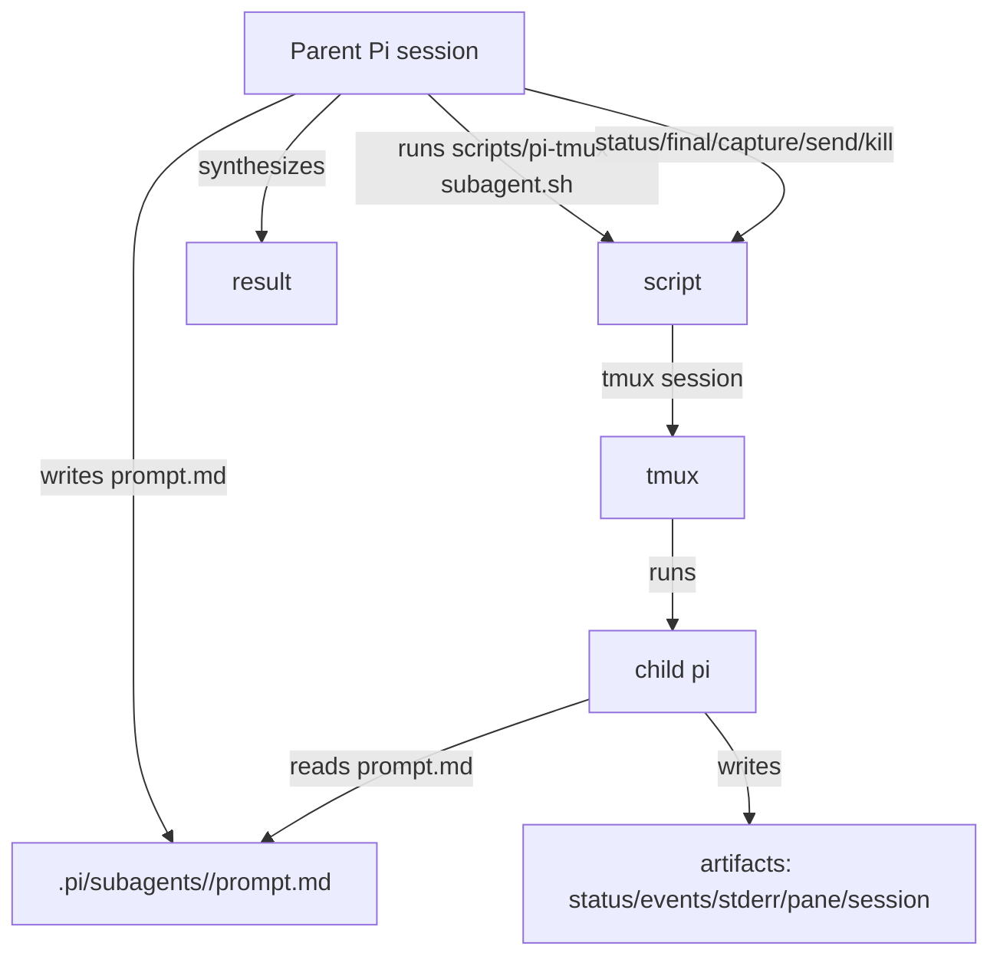

# Pi tmux sub-agents

Use this skill when you want Pi to delegate work by spawning another `pi` process under `tmux`, rather than using a dedicated sub-agent extension. The goal is transparent, shell-native delegation: every child has a real terminal, inspectable logs, optional JSON event output, and optional saved Pi session files.

Prefer the bundled runnable script over hand-written tmux snippets. It encodes the verified launch patterns: separate stdout/stderr for JSON mode, `remain-on-exit` for post-run pane inspection, pane logging, clean child sessions by default, and structured command output. In JSON mode, `events.jsonl` is the clean raw JSON event stream; pane capture is for human observability and may include wrapping or terminal framing. Use the `final` command for human-readable final text.

## Mental model



## Available script

- `scripts/pi-tmux-subagent.sh` — Launch and manage observable child Pi sessions in tmux.

Always run script paths relative to this skill directory. In Pi, resolve the script path against the skill directory before calling it. From this repo, that path is usually:

```bash
skills/pi-tmux-subagents/scripts/pi-tmux-subagent.sh --help
```

The script requires `bash`, `tmux`, `pi`, and `jq`. It writes diagnostics to stderr. `spawn-json`, `spawn-interactive`, `status`, `send`, `kill`, and `list` write JSON/JSONL to stdout.

Check the interface first when in doubt:

```bash
skills/pi-tmux-subagents/scripts/pi-tmux-subagent.sh --help
```

## When to use

- Fresh-context review of a diff, PR, plan, or file set.
- Local code reconnaissance that writes a reusable `context.md` artifact.
- External or local research that should not pollute the parent context.
- Long-running analysis where the parent should keep working.
- Co-debugging where a human or parent agent may attach to the child terminal.
- Advisory second opinions where observability matters more than automation convenience.

## When not to use

- Trivial checks the parent can run directly.
- Parallel write-heavy implementation in the same checkout.
- Hiding context gathering from the user.
- Tasks where the packaged `subagent` tool is explicitly requested or already better suited.
- Any repo you do not trust: child Pi has the same local permissions as the parent unless you restrict tools or sandbox externally.

## Decision rules

- **One writer by default.** Use child agents for review, research, context, and advisory work. Keep edits in one thread unless you intentionally isolate worktrees/checkouts.
- **Use `spawn-json` for harvestable one-shot output.** It runs `pi --mode json -p`, captures structured events, and exits when done.
- **Use `spawn-interactive` for steerability.** It starts an attachable Pi session with saved session files and accepts `send` follow-ups.
- **Keep child sessions clean by default.** The script passes `--no-extensions --no-skills --no-prompt-templates` unless `--keep-resources` is supplied.
- **Do not set thinking flags generically.** Thinking-level support is model/provider-specific. If needed, use `--model model:level` only when you know the selected model supports that value.
- **Split data and diagnostics.** `events.jsonl` is stdout-only JSON. `stderr.log` is separate.

## Artifact layout

By default, spawn commands write project-local artifacts:

```text
.pi/subagents/
  <timestamp>-<name>/
    prompt.md        # if you place it there; exact child prompt
    command.sh       # exact generated child command
    launcher.sh      # exact generated tmux launcher
    status           # running | complete | failed | killed
    events.jsonl     # JSON-mode event stream, stdout only
    stderr.log       # stderr from child pi
    pane.log         # raw tmux pane output, often with ANSI escapes
    sessions/        # optional child Pi session files
```

For non-repo tasks, pass `--dir ~/.pi/agent/subagents/<run-id>`.

Project-local artifacts should remain local. This repo ignores `.pi/subagents/` so smoke tests and review fanout runs do not pollute git status.

## Prompt contract for child Pi sessions

Give children a compact contract instead of vague delegation:

```markdown
You are a child Pi session launched from a parent Pi session.

Goal:
...

Scope:
...

Constraints:
- Do not spawn further sub-agents unless explicitly asked.
- Do not edit files unless this prompt explicitly authorizes edits.
- Prefer writing findings to the requested artifact path when one is provided.
- Include concrete file paths, commands run, and validation evidence.

Output:
...
```

For review-only children, include:

```markdown
Hard constraint:
Do not modify files. Report findings only.
```

For context builders, request a durable artifact:

```markdown
Output artifact:
Write `.pi/subagents/<run-id>/context.md` containing:
- Relevant files inspected
- Important symbols/APIs
- Current behavior
- Risks/gaps
- Recommended next prompt for the parent
```

## Workflow: one-shot JSON child

Use this for reviews, research briefs, and other jobs where the parent will harvest output from `events.jsonl`.

1. Create a prompt file in a run directory:

```bash
run_id="$(date +%Y%m%d-%H%M%S)-review"
dir=".pi/subagents/$run_id"
mkdir -p "$dir"

cat > "$dir/prompt.md" <<'EOF'
You are a fresh Pi review sub-agent.

Goal:
Review the current working tree for bugs, regressions, and missing validation.

Constraints:
- Do not edit files.
- Inspect the repository directly.
- Return only evidence-backed findings with file paths and line references where possible.

Output:
Write a concise review summary.
EOF
```

2. Spawn the child:

```bash
skills/pi-tmux-subagents/scripts/pi-tmux-subagent.sh spawn-json \
  --name review \
  --prompt "$dir/prompt.md" \
  --dir "$dir"
```

Example output:

```json
{"session":"pi-20260507-120000-review","dir":"/abs/repo/.pi/subagents/20260507-120000-review","mode":"json","status":"running"}
```

3. Monitor status and pane output:

```bash
skills/pi-tmux-subagents/scripts/pi-tmux-subagent.sh status --dir "$dir"
skills/pi-tmux-subagents/scripts/pi-tmux-subagent.sh capture --session "pi-$run_id" --lines 120
```

4. Extract final assistant text after completion. JSON-mode `events.jsonl` is raw event JSON, so this command is the preferred human-readable view:

```bash
skills/pi-tmux-subagents/scripts/pi-tmux-subagent.sh final --dir "$dir"
```

5. Clean up the dead tmux pane when done and mark the artifact as killed:

```bash
skills/pi-tmux-subagents/scripts/pi-tmux-subagent.sh kill --session "pi-$run_id" --dir "$dir"
```

Use `--save-session` with `spawn-json` if the child JSON-mode session should also be saved under `<dir>/sessions`.

Use `--keep-resources` if the child needs package extensions, custom tools, prompt templates, or skills.

## Workflow: interactive child in tmux

Use this when you want to attach, co-debug, steer, or save the full child Pi conversation.

```bash
run_id="$(date +%Y%m%d-%H%M%S)-interactive"
dir=".pi/subagents/$run_id"
mkdir -p "$dir"

cat > "$dir/prompt.md" <<'EOF'
You are an interactive child Pi session running inside tmux.
Do not edit files unless explicitly authorized.
Start by summarizing your understanding of the task.
EOF

skills/pi-tmux-subagents/scripts/pi-tmux-subagent.sh spawn-interactive \
  --name interactive \
  --prompt "$dir/prompt.md" \
  --dir "$dir"
```

Observe:

```bash
skills/pi-tmux-subagents/scripts/pi-tmux-subagent.sh capture --session "pi-$run_id" --lines 120
tmux attach -t "pi-$run_id"
```

Send a follow-up prompt:

```bash
skills/pi-tmux-subagents/scripts/pi-tmux-subagent.sh send \
  --session "pi-$run_id" \
  --message "Run exactly one harmless command: pwd, then summarize it."
```

Stop:

```bash
skills/pi-tmux-subagents/scripts/pi-tmux-subagent.sh kill --session "pi-$run_id" --dir "$dir"
```

Saved child session files appear under:

```bash
find "$dir/sessions" -type f
```

## Workflow: parallel review fanout

Use parallel tmux sessions for read-only reviewers or scouts. Give each child its own artifact directory and output file. Do not let multiple children edit the same checkout.

```bash
base=".pi/subagents/$(date +%Y%m%d-%H%M%S)-parallel-review"
mkdir -p "$base"

for angle in correctness tests maintainability; do
  dir="$base/$angle"
  mkdir -p "$dir"

  cat > "$dir/prompt.md" <<EOF
You are a fresh Pi review sub-agent.

Review the current diff from the perspective of: $angle.

Constraints:
- Do not edit files.
- Inspect the repository directly.
- Report only evidence-backed findings.
- Include file paths and line references where possible.
EOF

  skills/pi-tmux-subagents/scripts/pi-tmux-subagent.sh spawn-json \
    --name "review-$angle" \
    --prompt "$dir/prompt.md" \
    --dir "$dir"
done
```

List running children:

```bash
skills/pi-tmux-subagents/scripts/pi-tmux-subagent.sh list
```

Collect statuses:

```bash
for dir in "$base"/*; do
  skills/pi-tmux-subagents/scripts/pi-tmux-subagent.sh status --dir "$dir"
done
```

Collect final outputs:

```bash
for dir in "$base"/*; do
  echo "===== $dir ====="
  skills/pi-tmux-subagents/scripts/pi-tmux-subagent.sh final --dir "$dir"
done
```

## Workflow: context artifact child

Use this before implementation when the parent needs clean reusable context.

```bash
run_id="$(date +%Y%m%d-%H%M%S)-context"
dir=".pi/subagents/$run_id"
mkdir -p "$dir"

cat > "$dir/prompt.md" <<EOF
You are a child Pi context-builder session.

Goal:
Build implementation context for: <TASK HERE>

Constraints:
- Do not edit product code.
- Read all relevant files needed to understand the task.
- Stop after enough evidence; do not exhaustively inspect unrelated areas.

Output:
Write $PWD/$dir/context.md with:
- Request summary
- Relevant files inspected
- Important APIs/symbols
- Current behavior
- Risks and unknowns
- Recommended parent prompt for implementation
EOF

skills/pi-tmux-subagents/scripts/pi-tmux-subagent.sh spawn-json \
  --name context \
  --prompt "$dir/prompt.md" \
  --dir "$dir"
```

After completion, read both `context.md` and the JSON-mode final output.

## Command reference

```bash
# Help
skills/pi-tmux-subagents/scripts/pi-tmux-subagent.sh --help

# One-shot JSON child
skills/pi-tmux-subagents/scripts/pi-tmux-subagent.sh spawn-json --name review --prompt prompt.md

# Interactive child
skills/pi-tmux-subagents/scripts/pi-tmux-subagent.sh spawn-interactive --name debug --prompt prompt.md

# Status JSON
skills/pi-tmux-subagents/scripts/pi-tmux-subagent.sh status --dir .pi/subagents/<run-id>

# Extract final assistant text from events.jsonl
skills/pi-tmux-subagents/scripts/pi-tmux-subagent.sh final --dir .pi/subagents/<run-id>

# List pi-* tmux sessions as JSON lines
skills/pi-tmux-subagents/scripts/pi-tmux-subagent.sh list

# Capture pane text
skills/pi-tmux-subagents/scripts/pi-tmux-subagent.sh capture --session pi-<run-id> --lines 120

# Send steering input
skills/pi-tmux-subagents/scripts/pi-tmux-subagent.sh send --session pi-<run-id> --message "Summarize and stop."

# Kill session and mark artifact status killed
skills/pi-tmux-subagents/scripts/pi-tmux-subagent.sh kill --session pi-<run-id> --dir .pi/subagents/<run-id>
```

## Raw tmux escape hatches

The script should cover normal use. If it fails or you need to debug tmux directly:

```bash
# Attach interactively
tmux attach -t "$session"

# Tail pane
tmux capture-pane -pt "$session" -S -120

# Send Ctrl-C
tmux send-keys -t "$session" C-c

# Kill
tmux kill-session -t "$session"
```

## Troubleshooting

### `jq` fails on `events.jsonl`

Check whether stderr was merged into stdout. The script keeps `events.jsonl` and `stderr.log` separate. If you launched manually, use:

```bash
pi --mode json -p ... 2> stderr.log | tee events.jsonl
```

### tmux session disappears after child exits

Use `scripts/pi-tmux-subagent.sh spawn-json`. It creates the session, enables `remain-on-exit`, starts `pipe-pane`, then sends the command.

### Interactive child loads unwanted extensions or MCP servers

The script starts clean by default. If a child needs resources, pass `--keep-resources` intentionally.

### Thinking-level errors

Remove thinking overrides unless you know the active model supports that exact value.

### Pane log contains ANSI escape sequences or wrapped JSON

That is expected for interactive Pi and can also happen when a terminal pane wraps JSON-mode output. Prefer `events.jsonl` for machine parsing. Use `pane.log` and `capture` for human observability.

### Child hangs or drifts

Ask for a checkpoint first:

```bash
skills/pi-tmux-subagents/scripts/pi-tmux-subagent.sh send \
  --session "$session" \
  --message "Summarize what you have done, what command is running, and whether you are blocked."
```

If it remains blocked:

```bash
skills/pi-tmux-subagents/scripts/pi-tmux-subagent.sh kill --session "$session" --dir "$dir"
```
